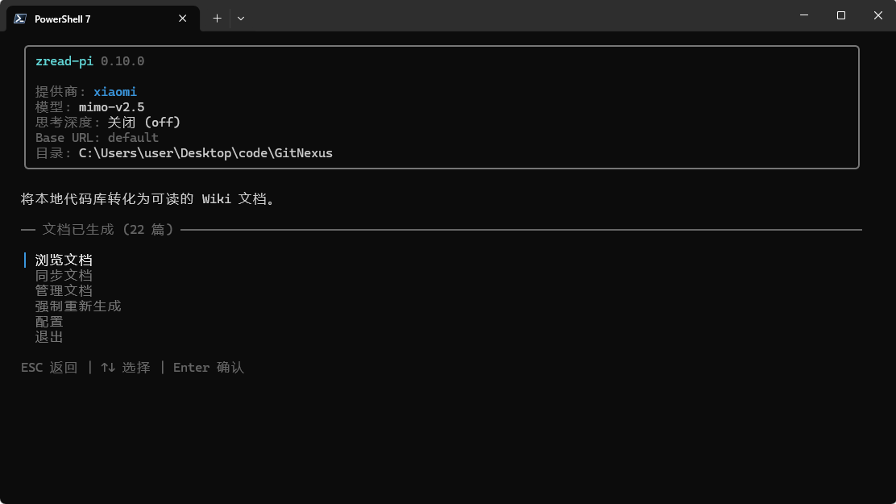
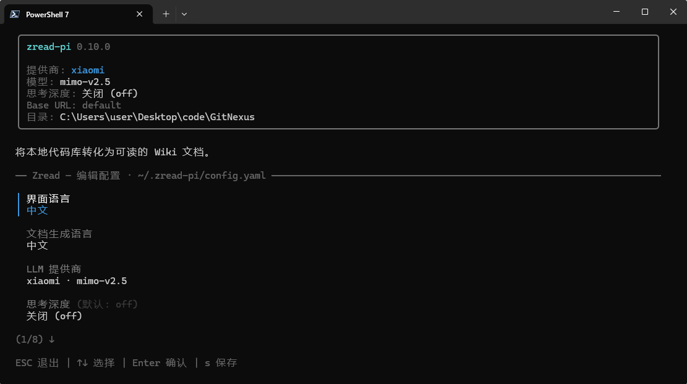
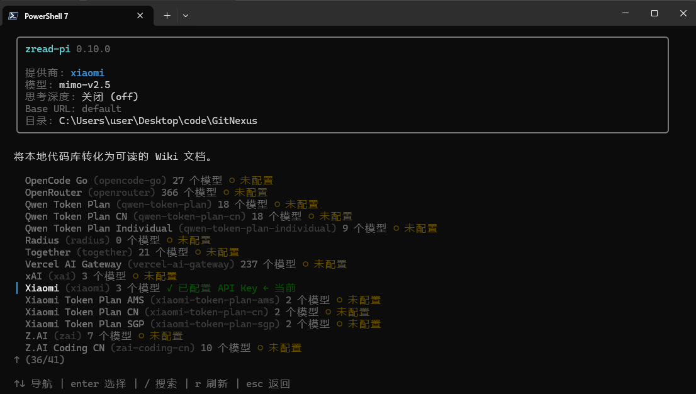
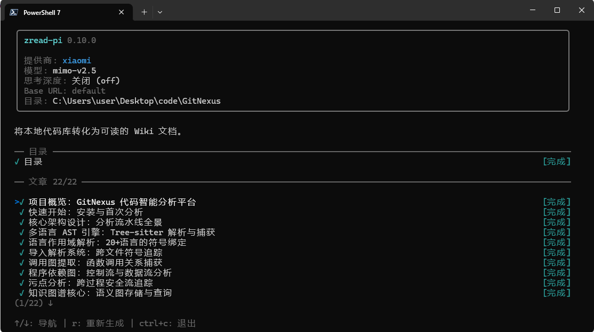
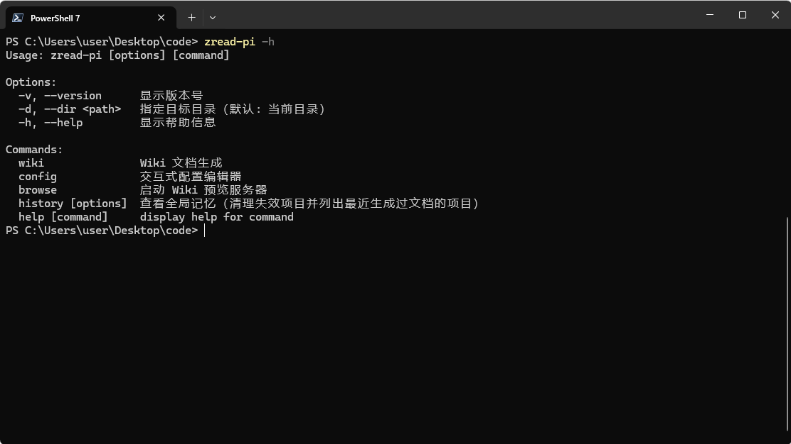
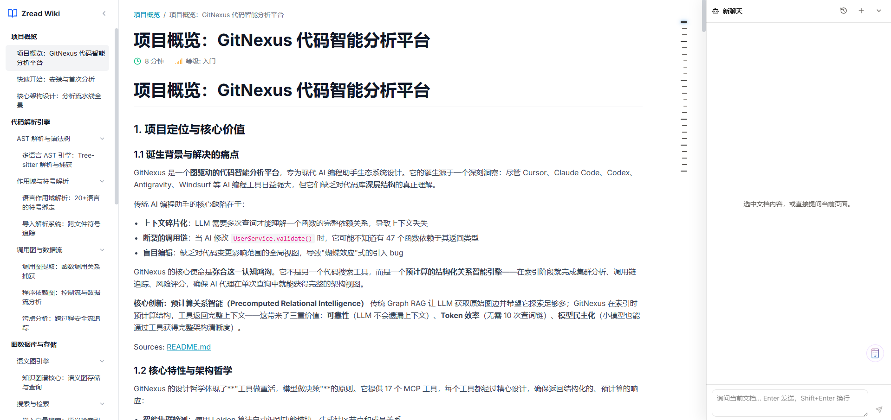

<h1 align="center">zread-pi</h1>

<p align="center">
  <strong>一行命令，把任何代码库变成一份高质量的 Wiki。</strong><br>
  本地运行的 AI 代码库导航器：扫描 → 解析 → 蓝图 → 并行页面生成，全程代码不出本机（只与你配置的 LLM 通信）。
</p>

<p align="center">
  
  
  
  
</p>

<p align="center">
  
</p>

---

## 为什么做 zread-pi

文档会腐烂，zread-pi 让它保持鲜活。

- **几分钟上手，而不是几周。** 对任何陌生代码库，得到一份带模块边界与架构图的 Wiki。
- **专注代码本身。** AI 从源码提取接口、依赖与用法示例，不需要你随手补文档注释。
- **刷新，而不是重写。** 符号级增量缓存让代码变更后的再生成又快又省。
- **代码不出本机。** 完全本地运行，无遥测、无第三方服务，数据只发往你自己配置的 LLM 端点。
- **自带 LLM。** 内置 40 个 Provider 目录（Anthropic、OpenAI、DeepSeek、Moonshot、Qwen 等），
  也支持任意 OpenAI 兼容端点与自定义模型。
- **三平台等价可用。** Windows / Linux / macOS 全部命令与工具链行为一致（含纯 JS 兜底，不依赖 POSIX 专属命令）。

## Features

> [!TIP]
> zread-pi 不是「包一层 LLM API」——业务层运行在 [pi](https://github.com/earendil-works/pi) 的 agent 内核
> （`pi-ai` + `pi-agent-core`）之上，专为「理解代码库」这件事打造。

- **三层 Repo Map** —— 目录拓扑 → 高频签名 → 按需深挖。超大规模仓库也不会撑爆上下文预算。
- **三阶段蓝图** —— 分类 → 分主题 → 标题，每个章节由独立 Agent 并行规划，slug 与编号由代码统一分配；分类阶段同时产出每个章节的**边界清单（scope：包含 / 不包含）**，逐级注入下游主题 / 标题 / 写作阶段防漂移；不再让一个 Agent 一次性吐全量目录，文章数更充足，单个章节失败也不影响其余。
- **五档蓝图细节（`blueprint.detail`）** —— 从 `minimal`（1 个分类 · 1 篇全景导览，必须 Mermaid 架构图，适合快速了解）到 `max`（每分类 5~12 篇、深挖关联文件），默认 `high` 与旧行为一致；数量越界先由模型按归并 / 补充策略重提，仍不收敛则由缩编 Agent 或代码确定性兜底，生成永不悬挂。
- **多档共存 + 浏览切换** —— 每个档位的完整产物独立存放（`wiki/<档位>/`，互不覆盖）；浏览站侧边栏底部提供上拉档位选择器（显示各档位篇数，当前高亮），切换时同 slug 页面保留、否则落到新档位首页。旧的无档位产物以「默认」条目只读兼容。
- **仓库自述注入** —— 目标仓库若有 `AGENTS.md` / `CLAUDE.md`（含大小写变体与全局 `~/.zread-pi`），会把里面的架构说明与约定注入页面 Agent 的系统提示，让生成的 Wiki 与仓库自述保持一致。
- **文风纪律（humanizer）+ 读者优先（reader-first）** —— 按文档语言注入两套正交的写作纪律：humanizer 管「像人写的」（反 AI 腔，基于 Wikipedia "Signs of AI Writing"），reader-first 管「教会了读者」（教学型结构化自检）；可选 `full` 模式会在每页落盘后额外跑一次轻量 polish Agent，frontmatter / `Sources:` 溯源行 / Mermaid 代码块全程受「只许改散文」的 diff 断言保护，润色失败不会让页面失败。
- **符号级增量缓存** —— 基于 AST hash；未变更的符号跨运行直接跳过，Wiki 同步只重新生成源码确实变过的页面。
- **并行页面 Agent** —— `p-limit` 调度扇出，并发可配置；每个 Agent 只拥有一个 Wiki 页面，只读它需要的真实代码。
- **图片读取管线** —— `Read` 读图片时自动缩放到 2000×2000 / 4.5MB 以内（省 token、避免被 provider 拒收），BMP 等非内联格式自动转 PNG，并给出坐标换算提示。
- **上下文自动压缩** —— 由 pi 的 AgentHarness 内建承担：接近模型上下文上限时自动生成摘要（compact boundary）继续工作；实在腾不出空间时优雅停止，而不是等 provider 报上下文溢出。
- **token 预算 + 两段式提示** —— 预算按 harness 的 usage 事件/账本累计真实 tokens（不是数轮次）：用到约 70% 时注入软提示收敛，预算将尽时注入硬提示并给强制交卷轮，避免「探索不停、从不产出」。
- **生成过程可见的用量账本** —— 生成页每个条目（目录展开为每个 Agent 一行：分类 / 每章节的主题、标题 / 缩编；文章列表每篇一行）右侧都实时显示输入 token、输出 token、缓存读占比与当前上下文占比（已用 / 窗口），完成后也继续显示；底部另有全部 Agent 的合计，口径来自 pi 的 usage 账本（输入侧含缓存读写），按 `r` 重新生成不会清空已消耗的用量，多页并发生成时合计也不会重复计数。
- **思考深度可选** —— 7 档 thinking level（off → max），由模型能力自动 clamp，不支持的档位清楚标注。自定义模型在添加时可勾选 `xhigh` / `max` 扩展档（pi 的 opt-in 语义，需模型支持）；未勾选时这两档会被 pi 自动钳制到最近的受支持等级。
- **模型上下文/输出可覆盖** —— 目录外的模型或网关常不提供准确元数据：`/config/model-size` 可为当前模型显式覆盖上下文窗口与最大输出 tokens（留空 = 跟随目录默认），同时作用于请求输出上限、上下文压缩阈值与生成页的「上下文占比」分母。
- **Provider 无关** —— 统一抽象 Anthropic Messages 与 OpenAI Chat Completions 协议；在 TUI 里选 Provider、贴 API Key、
  挑模型，三步完成，可同时配置多个 Provider。
- **两层重试，尊重服务端语义** —— Agent 层指数退避（60s 封顶）只在「未产出内容」时重试，失败尝试不污染会话记录；Provider 层读取服务端 `Retry-After` 并按上限封顶，429 高峰期不会重试过早。
- **本地 Web 阅读器** —— `zread-pi browse` 启动 React 19 + Vite 预览站：侧边导航、Mermaid 图表渲染（支持放大查看）。
- **Wiki 同步，而不是 Wiki 覆盖** —— diff 感知的再生成：页面被标记为 `new` / `updated` / `unchanged` / `archived`，
  像审代码 diff 一样审文档变更。
- **全局记忆** —— 生成过的项目自动记录（`zread-pi history` 一键清理失效项），老项目打开即自动补录；配置 / 凭据 / 记忆的跨进程写入都有文件锁保护。
- **交付闸门** —— `zread-pi verify` 一条命令判定本次生成是否达标（结构 / 内容密度 / Mermaid / 溯源 / frontmatter），逐行 `PASS`/`FAIL`/`SKIP` + 退出码，可直接进 CI；溯源会核对页面声称的路径、行号与行内代码符号是否真实存在于源码（符号级只警告、不判失败），生成后也能自动跑一次并落 `verify.json`（`quality.verifyAfterGenerate`）。

## Quick Start

> [!NOTE]
> 要求 Bun ≥ 1.3、Node ≥ 22。

```bash
# 0) 全新 clone 后：安装依赖 + 构建 pi 内核 vendor 产物（vendor/pi/**/dist 不入库）
git clone <your-repo-url> zread-pi
cd zread-pi
bun install
bun run vendor:build

# 1) 类型检查 + 全部冒烟测试（离线，不需要任何 API Key）
bun run test

# 2) 离线全链路试跑：用 mock LLM 对夹具仓库跑「扫描 -> 蓝图 -> 并行页面」
bun run mock:wiki

# 3) 真机跑 CLI：先配置 LLM（API Key 写入 ~/.zread-pi/auth.json）
bun run cli config
bun run cli            # 在目标仓库根目录执行
```

然后在终端 UI 里：

1. 添加一个 LLM API Key（内置 40 个 Provider，也支持任意 OpenAI 兼容端点）。
2. 选好模型，回车「生成文档」。
3. 看并行 Agent 读你的代码，产出带 Mermaid 图表的 `Wiki/` 页面。

用浏览器阅读结果：

```bash
bun run cli browse     # 或 zread-pi browse（二进制安装后）
```

## CLI 参考

| 命令                     | 作用                                                                       |
| ------------------------ | -------------------------------------------------------------------------- |
| `zread-pi`               | 默认命令 —— 打开 Wiki TUI；检测已有文档时提供 生成 / 同步 / 浏览 选项      |
| `zread-pi wiki`          | 显式 Wiki 生成入口（与默认命令同一 TUI）                                   |
| `zread-pi config`        | 交互式配置编辑器 —— Provider、API Key、模型、思考深度、模型上下文/输出覆盖、最大轮次（折算 token 预算）、蓝图细节档位、文风润色、外部工具  |
| `zread-pi browse`        | 启动本地 Web 阅读器（地址由服务端返回，保证真实可访问）；侧边栏可切换已生成的各档位文档 |
| `zread-pi logview [runId]`| 启动轨迹（Trajectory）检查视图 —— 在浏览器回放本次 / 历次运行的完整事件流；runId 缺省 = 最近一次运行 |
| `zread-pi history [-c n]`| 清理全局记忆中已失效的项目记录并列出剩余项                                 |
| `zread-pi verify [--detail <档位>] [--enforce]` | 交付闸门：逐条输出 `PASS`/`FAIL`/`SKIP`（结构 / 内容密度 / Mermaid / 溯源 / frontmatter），末尾 `OVERALL PASS`/`FAIL`，退出码随之；溯源含路径真实、行号有效、行内代码符号可溯（WARN）与蓝图 `associatedFiles` 存在性；`--enforce` 才把内容密度门未达标计为失败，否则只列出 |
| `bun run tools:install`  | 无头安装外部搜索工具（rg / fd），可指定版本；配置界面 `/config/tools` 同效 |

所有子命令均支持 `-d / --dir <path>` 指定目标仓库（不用切 shell 目录）。

### 快捷键（TUI）

| 键               | 作用                          |
| ---------------- | ----------------------------- |
| `↑ / ↓` (`k/j`)  | 移动焦点（长列表自动窗口化）  |
| `Enter`          | 确认                          |
| `Esc`            | 返回 / 取消（根页面退出）     |
| `PageUp/Down` `Home/End` | 长列表翻页            |
| `r`              | 刷新（模型目录 / 重跑检测）   |
| `l`              | Wiki 首页 / 生成完成页 → 打开运行轨迹 |
| `Ctrl+C`         | 强制退出                      |

## 截图

<p align="center">
  
  
</p>
<p align="center">
  <em>在终端内完成 Provider / API Key / 模型选择 —— 内置 40 个 Provider，也可添加自定义端点与自定义模型。</em>
</p>

<p align="center">
  
</p>
<p align="center">
  <em>N 个并行页面 Agent 读真实代码，实时产出结构化 Markdown。</em>
</p>

<p align="center">
  
</p>
<p align="center">
  <em>内置帮助页 —— 命令与快捷键一览。</em>
</p>

## 工作原理

zread-pi 不会把代码一股脑塞给 LLM，而是模仿资深架构师读代码的方式：

```text
你的代码库
   │
   ├── 1. 扫描    glob + .gitignore 精确定位所有源码文件
   │
   ├── 2. 解析    Tree-sitter AST 提取导出、签名、依赖
   │
   ├── 3. 缓存    符号级 AST hash 跳过未变更文件 —— 省时省钱
   │
   ├── 4. 蓝图    规划 Agent 分三阶段构建目录（每阶段增量写入 wiki.json）：
   │                ├─ 分类   1 个 Agent 划分 3~8 个顶级章节（含概览/核心架构）
   │                ├─ 分主题  每个章节 1 个 Agent 并行规划文章（slug 与编号由代码统一分配）
   │                └─ 标题   每个章节 1 个 Agent 精修标题
   │
   └── 5. 生成    N 个并行页面 Agent 按模块读真实代码，
                  渲染 Mermaid 图表，产出结构化 Markdown
```

### 为什么三层 Repo Map 是关键

一个 5 万行的代码库完整序列化约 200 万 token —— 远超任何上下文窗口。常见做法要么丢真（对 README 做分块检索），
要么烧钱（每个页面都重喂整棵目录树）。

三层 Repo Map 借鉴人类架构师的上手方式：

1. **先看拓扑。** 什么在哪里？哪些目录像基础设施、哪些像业务域？
2. **再看热点签名。** 哪些导出被引用最多？那些就是承重接口。
3. **按需深挖。** 只有当规划 Agent 决定给模块 X 写页面时，才打开 X 的完整 AST。

结果：10 万行的仓库用约 5k token 就能画像，每个页面 Agent 只拉自己需要的内容。

### 为什么蓝图要分三阶段

让一个 Agent 一次性吐出全量蓝图（先分类、再逐页起名、再填关联文件）时，输出轮次一多模型就会提前收敛——
一个分类只写一两篇就“完成”，文章数明显偏少。zread-pi 把蓝图拆成三个各自专注的阶段：

1. **分类。** 一个 Agent 只看架构，产出 3~8 个顶级章节（强制包含概览 / 核心架构）；
2. **分主题。** 每个章节一个 Agent 并行规划文章（3~10 篇），跨章节并发由 p-limit 控制；
3. **标题。** 每个章节一个 Agent 只精修标题，输出量极小。

章节与文章数量由 `blueprint.detail` 五档控制（默认 `high` = 4~8 分类 / 每分类 3~10 篇）：
`minimal` 只产 1 个分类 + 1 篇全景导览（必须 Mermaid 架构图），`low` 为 2~5 分类且跳过标题精修。
档位越界时不会静默截断：模型先按归并 / 补充策略重提（最多 2 轮），仍不收敛则开一个只看清单本身的
缩编 Agent，最后才由代码确定性收尾；每次提交都回传「当前 N / 要求 min~max」的数量反馈，模型可随时自我校准。

slug、文件编号与去重全部由代码统一分配（不依赖模型命名），每个阶段都增量归并进 `wiki.json`，
单个章节失败不会影响其余章节，也不会丢掉已经生成的页面。

三个阶段的提示词还会**逐级注入上一级的大纲作为硬约束边界**，防止整站漂移：

1. 分类阶段为每个章节产出 `scope`（1~3 条「包含：…」+ 1~3 条「不包含：…（→ 相邻章节）」）——
   「不包含」是负向边界，专门阻止模型把别的章节内容顺手写进来；
2. 分主题阶段把本分类的 scope 注入提示词，只规划「包含」范围内的主题；
   每篇文章还产出一句 `summary`（论证什么、以哪些文件为证据）；
3. 标题阶段注入 scope 防止精修跑题；页面生成阶段把 `summary` 与关联路径一起注入写作提示词，
   并附一行范围纪律（内容不得越出该主题）。

这些字段全部可选：旧版 `wiki.json` 没有 scope / summary 时，下游按「无边界」降级，行为与之前一致。

### Wiki 同步：diff 感知的再生成

代码变更后重跑不会推倒你的 Wiki。编排层会：

1. 重算每个文件的 AST hash；
2. 与缓存的符号清单做 diff，找出受影响的章节；
3. 只对受影响的章节做「分主题 / 标题」增量修补——未受影响的页面原样保留，
   页面 URL（slug / 文件名）不漂移；模型漏报的旧页面只要源文件还在也不会丢；
4. 页面状态（**unchanged** / **updated** / **new** / **archived**）由代码比较新旧清单机械判定；
   归档页面的快照保存在 `.zread-pi/wiki/archived/<时间戳>/`，什么都不丢。

## 支持的语言

| 语言               | AST 解析器                | 状态 |
| ------------------ | ------------------------- | :--: |
| TypeScript / TSX   | tree-sitter-typescript    |  ✅  |
| JavaScript / JSX   | tree-sitter-javascript    |  ✅  |
| Vue (SFC)          | tree-sitter-vue           |  ✅  |
| Go                 | tree-sitter-go            |  ✅  |
| Python             | tree-sitter-python        |  ✅  |
| Rust               | tree-sitter-rust          |  ✅  |
| Java               | tree-sitter-java          |  ✅  |
| C                  | tree-sitter-c             |  ✅  |
| C++                | tree-sitter-cpp           |  ✅  |
| C#                 | tree-sitter-c_sharp       |  ✅  |
| Ruby               | tree-sitter-ruby          |  ✅  |
| Swift              | tree-sitter-swift         |  ✅  |
| Kotlin             | tree-sitter-kotlin        |  ✅  |
| PHP                | tree-sitter-php           |  ✅  |

新增语言只需在 `packages/repo-analyzer/src/parser/constants.ts` 的 WASM 映射中登记 grammar。PR 欢迎贡献。

## 支持的 LLM Provider

内置 pi-ai 的 40 个 Provider（离线可用，含精选模型默认值），并支持任意 OpenAI 兼容端点：

| 海外                                                              | 国内                                                                        |
| ----------------------------------------------------------------- | --------------------------------------------------------------------------- |
| Anthropic · OpenAI · Google Gemini · Mistral · Cohere · xAI · Groq | DeepSeek · Moonshot · MiniMax · 智谱 · Qwen · 豆包 · Yi · 百川 · StepFun 等 |

没找到你的？在 TUI 里走「自定义 Provider」流程：填写 Provider 名称、任意 OpenAI / Anthropic / Gemini 兼容
Base URL 与协议即可创建一个与内置 Provider 等价的提供商（可起任意名字、可添加多个自定义模型，
API Key 与模型列表都在其详情页里维护）；也能为任意 Provider 添加自定义模型
（上下文窗口 / 最大输出 / 思考 / 图片能力，开启思考后还可勾选 `xhigh` / `max` 扩展思考档）。

## 配置

配置归 zread-pi 自管理，全部可在 TUI 中维护，无需手写 YAML：

- `~/.zread-pi/config.yaml` —— 非敏感配置：UI / 文档语言、`llm.provider/model`、每个 Provider 的
  名称（自定义 Provider）、`base_url` 与自定义模型、思考深度（`llm.thinking_level`）、模型上下文/输出覆盖（`llm.context_window` /
  `llm.max_tokens`，留空 = 跟随模型目录默认；配置界面 `/config/model-size`）、token 预算（`agent.token_budget`，0 = 按
  `agent.max_turns × 25000` 折算；`agent.max_turns = 0` = 不限制预算）、文风润色（`polish.enabled`，
  `polish.mode = prompt-only | full`）、蓝图细节档位（`blueprint.detail = minimal | low | medium | high | max`，默认
  `high`；配置界面 `/config/detail`）、内容质量门（`quality.contentGate.enabled` /
  `quality.contentGate.mode = off | warn | enforce`，默认 `true` / `warn`；配置界面 `/config/quality`——
  `warn` 只报告不拦截，`enforce` 会拦截干瘪页面并要求重写，预算耗尽后 best-effort 落盘并标注告警）、
  外部工具开关（`tools.<id>.enabled`）。
  重试次数（`concurrency.max_retries`，0–5，0 = 不重试，配置界面 `/config/retry`）同时下发到 Agent 层与
  Provider 层：前者指数退避（2s 起、60s 封顶），后者在单次请求内读取服务端 `Retry-After`。
- `~/.zread-pi/auth.json` —— pi-ai 格式凭据（API Key），可同时保存多个 Provider；**秘密不进 config.yaml**。
- `~/.zread-pi/models-store.json` —— 动态 Provider 的模型目录缓存。

> [!IMPORTANT]
> API Key 存放在 `~/.zread-pi/auth.json`，除调用你配置的 Provider 外不会离开本机。共享机器请自行收紧文件权限。

## 输出结构

```
your-project/
└── .zread-pi/
    ├── wiki/
    │   ├── minimal/                    # 每个档位一套独立完整产物（互不覆盖）
    │   ├── low/
    │   ├── medium/
    │   ├── high/                       # 默认档位
    │   │   ├── wiki.json               # 蓝图：页面、分区、技术栈摘要、档位
    │   │   ├── {section}/{page}.md      # 生成的 Markdown 页面（当前版本）
    │   │   └── archived/<快照名>/        # 同步时归档的旧页面快照
    │   └── max/
    ├── runs/                            # 运行轨迹（每次生成 / 同步一个目录）
    │   └── 2026-09-15T23-46-21-ffd1/
    │       ├── events.jsonl         # 瘦业务事件（run/page/stage 边界 + agent_config + provider_request）
    │       ├── sessions/           # pi 会话（唯一完整事实源：消息 / 工具 / 用量 / 压缩）
    │       └── run.json            # 元数据：状态 / agent 计数 / 页面进度 / 用量合计
    └── cache/
        ├── last_manifest.json           # 文件扫描结果
        └── last_symbols.json            # AST-hash 符号缓存
```

每页都是内嵌 Mermaid 图表的纯 Markdown —— GitHub、GitLab、Docusaurus、Notion、你自己的静态站点都能直接渲染。

> **版本隔离**：只有项目家目录 `~/.zread-pi/version` 记录创建它的版本，
> 仓库输出目录 `.zread-pi/` 都是可再生产物、不守卫。
> 家目录的来源版本若**早于最后一次不兼容变更**（或没有版本标记），旧目录会被原样改名
> 为 `.zread-pi_bak`（完整保留）然后重建新目录 —— 需要的文件请从备份里拷回；
> 兼容版本只静默更新版本标记、不动数据。环境变量 `ZREAD_PI_VERSION_GUARD=0` 可跳过该检查。
> 本项目仍在初期快速迭代，不保证跨版本兼容，升级前请自行备份 `~/.zread-pi`。

### 轨迹检查视图（Trajectory）

每次生成或同步都会把**完整事件流**落盘到 `.zread-pi/runs/<runId>/`，
可在浏览站里逐条回放、检查、搜索与过滤 —— 回答「这次生成到底发生了什么」。

**入口**（任选其一）：

- Wiki 首页按 `l`，或侧边栏底部的「轨迹检查」；
- 生成完成页底部提示的 `l: 查看运行轨迹`；
- 无头环境：`zread-pi logview [runId]`（runId 缺省 = 最近一次运行）；
- 浏览站直达 `http://localhost:<port>/trajectory`。

**界面操作**：

| 操作                 | 作用                                                                 |
| -------------------- | -------------------------------------------------------------------- |
| 点击行                | 选中记录，右侧检查器展示完整载荷 / 工具参数 / 结果 / 用量 / TTFT        |
| `↑ / ↓`              | 在可选记录间移动（自动滚入视口）；`Esc` 清除选择                       |
| 点击 turn 头          | 折叠 / 展开该 turn（一个 Agent = 一个 turn）                           |
| turn 头上的 Eye       | **隐藏该会话**（并发运行时每个 Agent 一个会话，隐藏后表格与时间线同步重投影；工具栏显示「已隐藏 N 个会话」，点「显示全部」恢复） |
| 搜索框                | 多词交集过滤（命中高亮；匹配提示 / 工具参数 / 输出 / 工具名）           |
| `Turns` / `Steps`    | 全部 turn 折叠 / 同组连续助手消息合并                                  |
| 时序条拖拽            | 框选时间区间，过滤出台账里只属于该区间的记录                            |
| 时序条滚轮            | 以光标为中心缩放（sequence 模式下滚轮无效果）                          |
| 时序条右键            | 清除选区                                                              |
| 时序条悬停            | 显示该区间的记录摘要                                                  |
| `Sequence/Duration/Time/Actual` | 时序投影模式：序号 / 压缩空闲的时长 / 真实墙钟点 / 真实时长 |
| 检查器左缘拖拽        | 调整详情面板宽度                                                       |
| 检查器 `‹ ›`         | 跳到上一条 / 下一条模型请求（跨 turn 的统一编号空间）                   |
| 「Load older events」 | 向前翻更旧的事件页（贴底时新事件自动滚入）                              |

轨迹页是全宽独立路由（不渲染 wiki 侧边栏）；运行未结束时自动轮询尾随新事件，
结束后停止。单个目标仓库默认保留最近 20 次运行（`ZREAD_PI_RUNS_RETENTION` 覆盖，
`<= 0` 不清理）；新运行开始时，残留的 `running` 状态旧运行会被自动标记为 `interrupted`。

**界面语言**：轨迹页（及整个浏览站）跟随 CLI 配置的界面语言（`~/.zread-pi/config.yaml`
的 `language` 字段，`zh` → 简体中文 / `en` → 英文）。服务端在打开网页时读取一次配置并
下发给前端；CLI 里改完语言重新打开网页即生效。记录徽标（`TOOL` / `MSG` 等）与事件流里的
原始文本保持原样不翻译。

<p align="center">
  
</p>

## 使用场景

- **开源维护者** —— 不用写一页文档，就能随 README 交付一份真实的 Wiki。
- **新人上手** —— 入职第一天就获得代码库导览，而不是第三周。
- **并购尽调** —— 一小时内产出陌生代码库的架构概览。
- **遗产代码考古** —— 从原作者早已离职的代码库里找回机构知识。
- **内部平台团队** —— 用 CI 触发再生成，让平台 / SDK 文档持续与代码同步。

## 对比

| 方案                          | 局限                                     | zread-pi                                            |
| ----------------------------- | ---------------------------------------- | ---------------------------------------------------- |
| 手写文档                      | 慢、与代码漂移、没人爱写                 | AI 从源码生成；重跑保持同步                          |
| Copilot / Cursor              | 只有文件级上下文，没有全局视图           | 三层 Repo Map 提供上帝视角                           |
| Mintlify / JSDoc              | 只覆盖前端生态                           | AST 级解析 14 种语言，前后端通吃                     |
| 闭源 AI 文档 SaaS             | 订阅费 + 代码上传第三方                  | 完全开源、本地运行，数据不出本机                     |
| 朴素 RAG-over-README          | 泛泛摘要，信号量低                       | 每模块 Agent 自适应呈现 API 与架构                   |
| 手搭 Docusaurus / VitePress   | 搭建成本高，内容仍要手写                 | 生成内容直接落进你现有的静态站点流水线               |

## FAQ

<details>
<summary><strong>一次典型运行要花多少钱？</strong></summary>

成本大致与 Wiki 页面数线性相关，而不是与代码行数。以 DeepSeek V3 为例，3 万行的 TypeScript 仓库一次完整生成
通常低于 $0.2；得益于符号缓存，之后的同步运行通常低于 $0.05。
</details>

<details>
<summary><strong>我的代码会被上传到哪里？</strong></summary>

只会发往你在 `config.yaml` 里配置的 LLM Provider。zread-pi 本身完全本地运行：无遥测、无自有服务器、
除你选择的 LLM 端点外没有任何第三方。
</details>

<details>
<summary><strong>能在 CI 里用吗？</strong></summary>

可以。配置齐全时 CLI 是非交互的，可包在 GitHub Action 里触发再生成并回写 Wiki。
外部搜索工具（rg / fd）可通过 `bun run tools:install` 无头安装，不依赖交互界面。
</details>

<details>
<summary><strong>代码库混用多种语言怎么办？</strong></summary>

有 grammar 的语言全部解析，没有的跳过。混合语言模块的页面会引用全部文件，但只为受支持的语言渲染结构细节。
</details>

<details>
<summary><strong>Windows 上能跑吗？</strong></summary>

能，且与 Linux / macOS 行为等价。文件工具不依赖 POSIX 专属命令（无 rg/fd 时走纯 JS 兜底，能力不降级），
外部工具解包为纯 JS 实现，不调用 tar/unzip/PowerShell。
</details>

<details>
<summary><strong>日志在哪里？出问题怎么排查？</strong></summary>

运行日志写在项目家目录下，按天滚动，默认是结构化 JSONL：

```text
~/.zread-pi/logs/zread-pi-<yyyy-MM-dd>.jsonl
```

每行一条 JSON（`{sn, ts, time, name, type, level, msg}`），`name` 是点号分层的模块名
（如 `orchestrator.pages`、`analyzer.scanner`），便于按子系统过滤。默认保留 30 天。
传统文本格式（`zread-pi-<日期>.log`，每行 `[本地时间] [级别] 模块名 消息`）默认关闭，
`ZREAD_PI_LOG_TEXT=1` 开启。

排障时可以：

- 看最近的错误与告警（JSONL）：

  ```bash
  jq -c 'select(.type=="error" or .type=="warn")' ~/.zread-pi/logs/zread-pi-*.jsonl | tail -n 40
  ```

- 文本格式（开启 `ZREAD_PI_LOG_TEXT=1` 后）：

  ```bash
  grep -E '\[ERROR\]|\[WARN\]' ~/.zread-pi/logs/zread-pi-*.log | tail -n 40
  ```

- 把日志同时打到终端（调试专用，**不要在 TUI 里开**——TUI 期间终端输出会被转回日志总线造成双写）：

  ```bash
  ZREAD_PI_LOG_CONSOLE=1 bun run cli
  ```

- 调整某部分的详细程度（只作用于 console，文件侧始终记录全部级别）：

  ```bash
  # 形如 default=info,orchestrator=debug；级别是 error/info/warn/debug
  ZREAD_PI_LOG_LEVEL="default=info,orchestrator=debug" ZREAD_PI_LOG_CONSOLE=1 bun run cli
  ```

- 改保留天数（`<= 0` 不自动清理）：

  ```bash
  ZREAD_PI_LOG_RETENTION_DAYS=7 bun run cli
  ```

- 结构化 JSONL 日志（机器分析用：jq / 脚本按 `name`/`level`/`ts` 过滤；**默认开启**，`ZREAD_PI_LOG_JSONL=0` 可关闭）：

  ```bash
  # 默认产出 ~/.zread-pi/logs/zread-pi-<日期>.jsonl，每行一条 JSON：
  jq -c 'select(.name=="orchestrator.pages")' ~/.zread-pi/logs/zread-pi-*.jsonl
  # 不需要时关闭：
  ZREAD_PI_LOG_JSONL=0 bun run cli
  ```

- 传统文本日志（`zread-pi-<日期>.log`，**默认关闭**——内容与 JSONL 重复，人工翻阅 / needle 排查用）：

  ```bash
  ZREAD_PI_LOG_TEXT=1 bun run cli
  ```
</details>

## 贡献

项目在快速迭代中。Issue、PR、新语言解析器与反馈都欢迎。

> [!TIP]
> 好的入手点：加一种 tree-sitter 语言（`packages/repo-analyzer/src/parser/constants.ts`）、
> 改进 TUI（遵循 `DESIGN.md` 设计系统）、或完善中英文案。

开发约定（分支 / 验证 / 版本号 / 合并流程）见 `AGENTS.md`；
设计决策与契约冻结点见 `AGENTS.md`（§1.1 / §1.2）；
UI 设计系统见 `DESIGN.md`；包结构与修改指南见 `RULES.md`。

如果这个项目帮你省了时间，去 GitHub 点个 ⭐ 就是最好的感谢。
