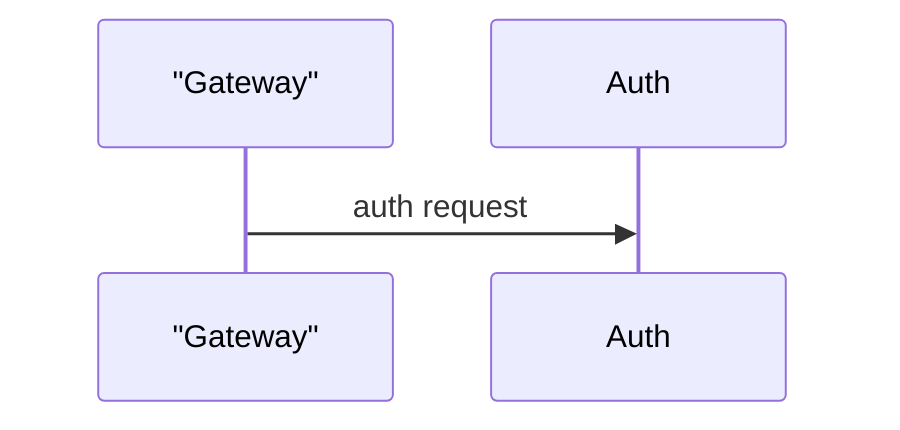

# Diagram selection and caption discipline (architecture / flow / sequence / state)

<!-- Division of labor with page-format: page-format only states "must use Mermaid +
     quote rules + topology or 0"; this file states "which diagram type this page
     should use, what must be read before drawing, and how to caption it".
     The zh and en versions must be edited together (items and numbering one-to-one).
     Only edit together with the zh version and agents/diagram-guide.ts. -->

Mermaid can draw many diagram kinds, but only four answer a code-wiki reader's questions.
Picking the wrong kind wastes the diagram: an architecture diagram cannot show a call
sequence, and a sequence diagram cannot show layering.

## Selection decision table (diagnose the page first, then pick)

| What the page diagnoses | Choose | Never |
|---|---|---|
| Module boundaries / layering / dependencies (overview, core-architecture pages) | Architecture diagram | Sequence diagram |
| One process / algorithm / request-handling pipeline | Flow diagram | Architecture diagram |
| A **call sequence** across modules and functions | Sequence diagram | Architecture diagram |
| The **lifecycle** of a connection / task / session | State diagram | Flow diagram |
| None of the above | **0 diagrams** | — |

- Architecture and flow diagrams share **one syntax** (both are `flowchart`); direction
  distinguishes the use: architecture uses `TB` / `BT` (top-down layering), flow uses
  `TD` / `LR` (temporal direction).
- A sequence diagram answers "who calls whom, and in what order"; its participants must
  be real modules / functions, not concepts.
- A state diagram answers "what states does it have and what condition moves it";
  state names and transition conditions must come from the code.
- **Anti-padding**: when the page covers none of the above, the correct number of
  diagrams is **0** — never add a diagram just to have one.

## Grounding before drawing (the script decides what the source has)

| Diagram kind | What must be confirmed before drawing | What each element maps to |
|---|---|---|
| Architecture | Directory / package / module boundaries (seen with `ls` / `read`) | Directories / packages / modules |
| Flow | Control flow inside the function body (the function was `read`) | Branches / steps inside the function |
| Sequence | Cross-function call relations (both ends were `read`) | Participants = modules / functions; messages = real calls |
| State | The state variable and its triggers (the code holding it was `read`) | States = state variables; transitions = real triggers |

For sequence diagrams prefer `participant A as "AuthGateway"`: the display name after
`as` participates in symbol comparison, while the alias is only an in-diagram coordinate.
Every message arrow must correspond to a call that really exists in the source; never
draw a call you are not sure about.

## Captions (mandatory: every diagram needs one)

The line **directly above** each mermaid fence must be a caption in this fixed shape:

`**Figure｜<type word>｜<one-line title>**: <optional one-line summary>`

- The type word may only be: **Architecture Diagram / Flow Diagram / Sequence Diagram /
  State Diagram**;
- The caption type word must **match** the diagram's actual syntax (a caption saying
  "Sequence Diagram" over a `flowchart` is rejected by write_page);
- The caption doubles as the sentence that introduces the figure before it appears —
  caption first, diagram second.

Correct example:

````markdown
**Figure｜Sequence Diagram｜Auth call chain**: gateway -> auth -> user store


````

## Prose after the diagram

Key edges need a sentence or two of interpretation after the diagram (the reader should
learn why things connect this way); never just drop a diagram and move on. That
interpretation is still prose and still follows the provenance discipline.
