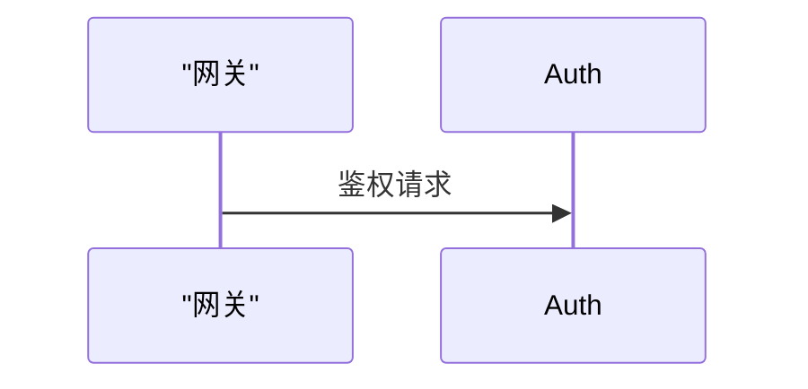

# 图表选型与题注纪律（架构 / 流程 / 序列 / 状态四类）

<!-- 与 page-format 的分工：page-format 只管「必须用 Mermaid + 引号规则 + 拓扑或 0」；
     本块管「这一页该画哪类图、画之前要读什么、题注怎么写」。
     zh / en 两份资产必须同步改动（条数与编号一一对应）。
     仅与 en 版本（同等翻译）、agents/diagram-guide.ts 一起改动。 -->

Mermaid 能画很多种图，但代码 wiki 只有四类图真正回答读者问题。选错图型
等于白画：架构图画不出调用时序，序列图画不出分层。

## 选型决策表（先诊断页面，再选图）

| 页面诊断出的内容 | 应选 | 禁选 |
|---|---|---|
| 模块边界 / 分层 / 依赖（概览页、核心架构页） | 架构图 | 序列图 |
| 一个过程 / 算法 / 请求处理管线 | 流程图 | 架构图 |
| 跨模块跨函数的**调用时序** | 序列图 | 架构图 |
| 连接 / 任务 / 会话的**生命周期** | 状态图 | 流程图 |
| 都不涉及 | **0 张** | — |

- 架构图与流程图是**同一种语法**（都是 `flowchart`），靠方向区分用途：
  架构图用 `TB` / `BT`（自上而下表达分层），流程图用 `TD` / `LR`（表达时序方向）。
- 序列图回答「谁在什么时候调用谁」，参与者必须是真实模块 / 函数，不是概念。
- 状态图回答「它有哪些状态、什么条件让它迁移」，状态名与迁移条件必须来自代码。
- **反注水**：页面不涉及上述任何内容时，图的正确答案是 **0**，不要为凑图而画图。

## 画图前的 grounding 要求（脚本决定源里有什么）

| 图型 | 画之前必须已确认 | 图里的每个元素对应 |
|---|---|---|
| 架构图 | 目录 / 包 / 模块边界（用 `ls` / `read` 看过） | 目录 / 包 / 模块 |
| 流程图 | 函数体内的控制流（`read` 过该函数） | 函数内的分支 / 步骤 |
| 序列图 | 跨函数调用关系（两端都 `read` 过） | 参与者 = 模块 / 函数；消息 = 真实调用 |
| 状态图 | 状态变量与触发点（`read` 过持有它的代码） | 状态 = 状态变量；迁移条件 = 真实触发点 |

序列图建议用 `participant A as "AuthGateway"` 写法：`as` 后的显示名参与
符号比对，别名只是图内坐标。每条消息箭头都要对应源码里真实存在的调用关系；
不确定的调用不要画进图里。

## 题注（硬性：每张图都必须有）

每张 mermaid 块的 **fence 上一行** 必须写一行题注，格式固定：

`**图｜<类型词>｜<一句话标题>**：<可选的一句话摘要>`

- 类型词只能是：**架构图 / 流程图 / 序列图 / 状态图**；
- 题注类型词必须与图的实际语法**一致**（题注写「序列图」却画了 `flowchart`
  会被 write_page 拦截）；
- 题注同时就是「图要先在正文里被提到再出现」的那一句话——题注在前，图在后。

正确示例：

````markdown
**图｜序列图｜登录鉴权调用链**：网关 → 鉴权服务 → 用户存储


````
```

## 图后的散文

关键边在图后要有一两句解读（读者看图能知道「为什么这样连」），不要只甩一张图。
解读仍是散文，要遵守溯源纪律。
